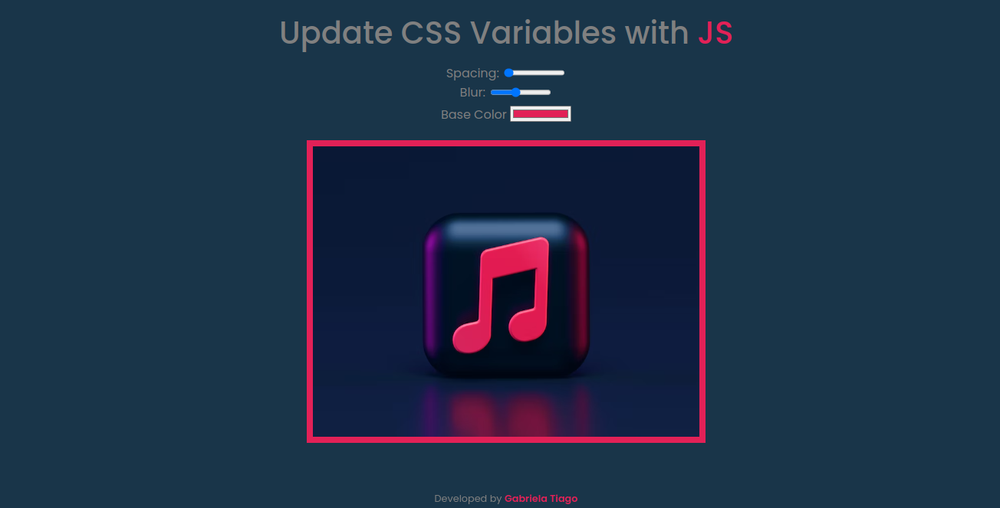
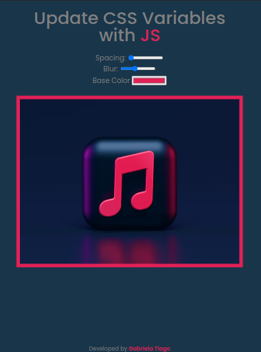
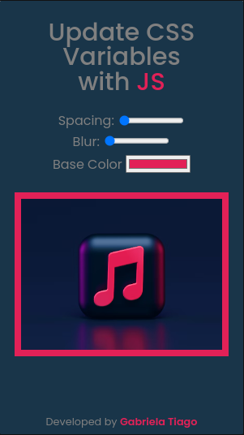
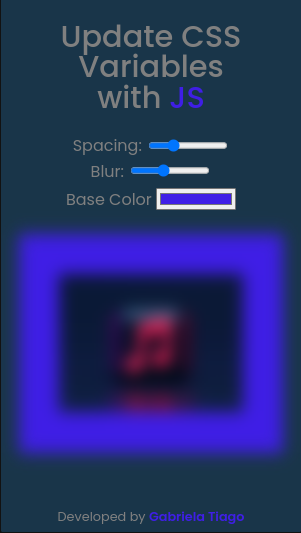

# 
 CSS Variables 

   
   
   

### :clipboard: Description

In this project you can play with the css variables, see in real time the changes on the screen. Choose the spacing, blur and color as you like

#### 🧮 [Access here](https://gabrielatiago.github.io/30-Days-JavaScript/CSS-Variables/index.html)

---

### :computer: Screen Preview

<h5>Desktop:</h5>

<h5>Tablet:</h5>

<h5>Mobile playing:</h5>

<h5>Mobile:</h5>

$~$

---

### :books: Lessons Learned

- CSS goblas variables
- Manipulate CSS with js
- Inserting CSS attributes via javascript
- How to use a HTML data tag

---

### :bulb: Acknowledgements

- [JavaScript 30 Challenge Inspiration](https://github.com/wesbos/JavaScript30)
- [Commit Patterns](https://github.com/iuricode/padroes-de-commits)
- [Badges for Github](https://github.com/alexandresanlim/Badges4-README.md-Profile#-database-)
- [README inspiration](https://gist.github.com/luanalessa/7f98467a5ed62d00dcbde67d4556a1e4#file-readme-md)

---

### 👩‍🦱 Author

- Gabriela Tiago is a fullstack web development student at Driven Education. Walking the path of knowledge in search of improving her technical skills and softskills, so she can improve the work she develops.

 [🔝 Back to top](#-css-variables-)  
