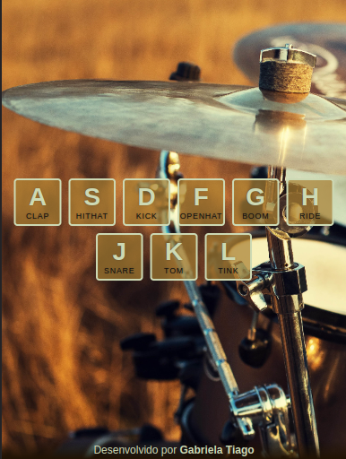
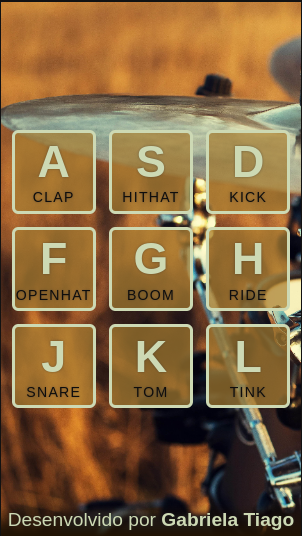

# 
 Drum Kit 

   
   
   

### :clipboard: Description

This project is a simplified version of a drum set, where you can press a key on your keyboard or click on a letter on the screen, then hear a sound from a drum part. Play and have fun creating your own musical combinations!

#### 🥁 [Access here](https://gabrielatiago.github.io/30-Days-JavaScript/Drum-Kit/index.html)

---

### :computer: Screen Preview

<h5>Desktop:</h5>

<h5>Tablet:</h5>

<h5>Mobile:</h5>

$~$

---

### :books: Lessons Learned

- Use audio tags
- HTML, CSS and JS review
- Event listener review
- Responsive layout review
- More about transitions
- Split functions responsibilities
- Markup language: Markdown

---

### :bulb: Acknowledgements

- [JavaScript 30 Challenge Inspiration](https://github.com/wesbos/JavaScript30)
- [Commit Patterns](https://github.com/iuricode/padroes-de-commits)
- [Badges for Github](https://github.com/alexandresanlim/Badges4-README.md-Profile#-database-)
- [README inspiration](https://gist.github.com/luanalessa/7f98467a5ed62d00dcbde67d4556a1e4#file-readme-md)

---

### 👩‍🦱 Author

- Gabriela Tiago is a fullstack web development student at Driven Education. Walking the path of knowledge in search of improving her technical skills and softskills, so she can improve the work she develops.

 [🔠Back to top](#-drum-kit-)  
